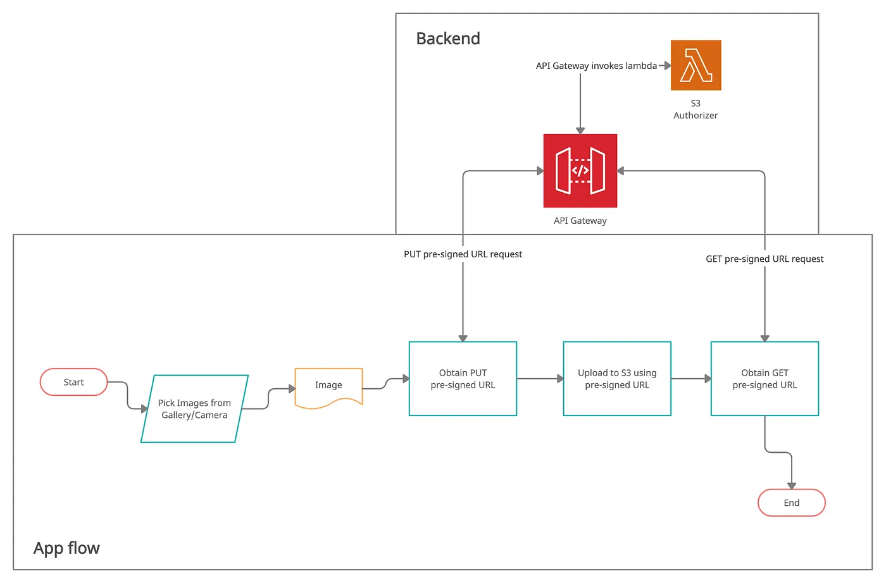

# Meradia



Link: https://merakilab-space.notion.site/Update-image-flow-c4d8b7ac4f4842049d7162621943db45?pvs=4

Để upload ảnh lên S3 storage bằng ReactJS và Golang, bạn có thể làm theo các bước sau:

### **Bước 1: Gọi Backend để lấy Presigned URL**

- Trong frontend (ReactJS), gửi một yêu cầu HTTP tới backend (Golang) để lấy presigned URL. Đảm bảo rằng backend đã cấu hình và có quyền truy cập vào Amazon S3.
- Backend sẽ nhận yêu cầu, sử dụng credential của nó để kết nối tới Amazon S3 và tạo một presigned URL. Presigned URL này sẽ được tạo với quyền truy cập cho việc upload (ACL) và có thời hạn.
- Backend sẽ trả về presigned URL cho frontend.

### **Bước 2: Tải ảnh lên S3 bằng Presigned URL**

- Trong frontend, sử dụng presigned URL đã nhận được để tải ảnh lên S3. Bạn có thể sử dụng các thư viện như Axios hoặc Fetch để thực hiện yêu cầu HTTP POST tới presigned URL với ảnh dữ liệu đính kèm.
- Khi yêu cầu này được gửi đi, ảnh sẽ được truyền từ frontend trực tiếp tới S3 thông qua presigned URL.

### **Bước 3: Xác nhận và lưu thông tin vào Backend**

- Sau khi quá trình upload hoàn thành, frontend có thể gửi một yêu cầu khác tới backend để thông báo rằng quá trình upload đã hoàn tất. Yêu cầu này có thể chứa thông tin về ảnh đã upload hoặc bất kỳ thông tin khác liên quan.
- Backend có thể tiếp nhận yêu cầu này, xác nhận rằng quá trình upload đã hoàn thành và lưu thông tin về ảnh vào cơ sở dữ liệu hoặc bất kỳ hệ thống nào khác.
- Sau khi lưu thông tin thành công, backend có thể trả về một liên kết (link) tới ảnh đã lưu, để frontend có thể truy cập và hiển thị ảnh.

Đây là một quy trình cơ bản để upload ảnh lên S3 storage sử dụng ReactJS và Golang. Tuy nhiên, cần lưu ý rằng cài đặt chi tiết của từng bước có thể thay đổi tùy thuộc vào yêu cầu và cấu hình của bạn.


---
# How to start source:
- Make sure you have read the [flow](flow.png) and understand it. By now you should understand how presigned url works and how to upload image to S3. Also you should know about imageproxy https://github.com/willnorris/imageproxy  and how to use it.
- Make sure you have the development environment matches with these notes below so we can mitigate any problems of version mismatch.
  - OS: Should use Linux (latest Ubuntu or your choice of distro) if possible. Windows does not play well with Docker and some other techs we may use. If you still prefer to use Windows, so you may have to cope with problems by yourself later since we're assuming everything will be developed and run on Linux.
  - Install Docker CE (latest) and docker-compose.
  - Install git for manage source code.
  - IDE of your choice, recommended Goland or VS Code.

### Development 
  - Clone code to local: ``` https://gitlab.com/merakilab9/meradia.git```
  - Add .env file: follow .env.example
  - Start development environment with Docker: ```make compose dev```
  - After started, services will be available at localhost with ports as below:
  ```Backend: 8099```
  ```ImageProxy: 8022```

### Testing api:

#### 1. PreUpload:
    ```curl
    curl --location 'localhost:8099/api/v1/media/pre-upload' \
    --header 'Content-Type: application/json' \
    --data '{
        "media_type": "png"
    }'
    ```

#### 2. Upload: BE test only; FE will use presigned url to upload
* get [PRESIGN_URL] from PreUpload api response
```curl
curl --location 'localhost:8099/api/v1/media/upload' \
--form 'upload_url="[PRESIGN_URL]"' \
--form 'file=@"/C:/Users/AlienWare/Downloads/3 copy 1.png"'
```

#### 3. Pos upload: Learn about imageproxy here: https://github.com/willnorris/imageproxy 
* get [FILE_NAME] from PreUpload api response
```curl
curl --location 'localhost:8099/api/v1/media/pos-upload' \
--header 'Content-Type: application/json' \
--data '{
    "name": "[FILE_NAME]",
    "media_type": "png",
    "type_to_crop": "avatar"
}'
```

#### Contact for support:
- Merakilab
- mail: pxthang97@gmail.com
